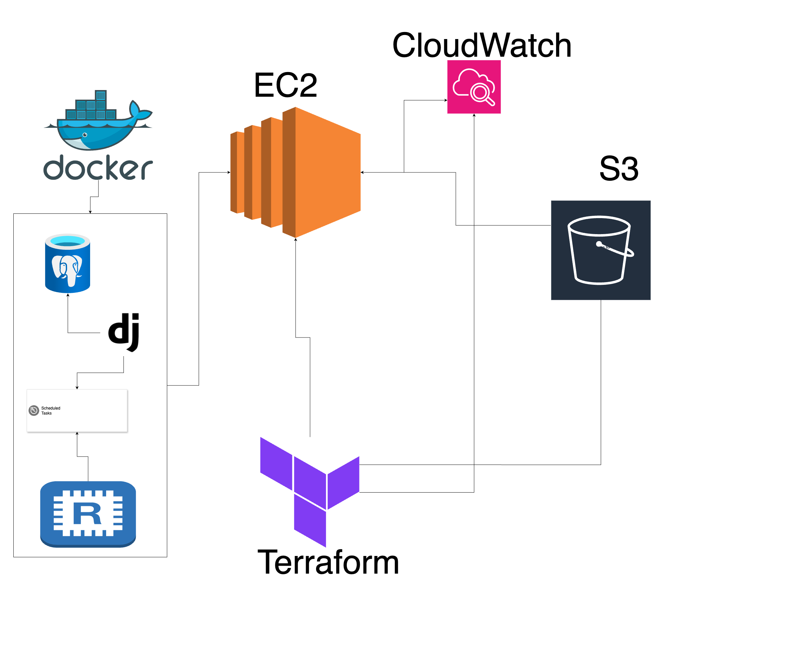

## 🏗️ Django Microservice Architecture (Docker + AWS EC2)

### **1. Project Structure & Key Technologies**
- **Backend:** Django 5.2 + DRF 3.16.0
- **Worker:** Celery 5.5.1 with Redis 5.2.1
- **API Documentation:** `drf-yasg` for Swagger UI
- **Database:** PostgreSQL 15 (via Docker)
- **Task Queue:** Redis (via Docker)
- **Deployment Target:** AWS EC2 instance (Amazon Linux)
- **Container Orchestration:** Docker Compose
- **Production Server:** Gunicorn (WSGI HTTP server for Python web apps)

---

### **2. Docker Integration**
- Dockerfile installs all Python dependencies from `requirements.txt`
- `entrypoint.sh` is used to conditionally run migrations and then serve the Django app using:
  ```bash
  gunicorn --bind 0.0.0.0:8000 core.wsgi:application
  ```
- `docker-compose.yml` runs the Django app.
---

### **3. EC2 Deployment via GitHub Actions**
- CI/CD setup using GitHub Actions and `appleboy/ssh-action`:
  - Checks out code and SSHs into EC2.
  - Installs Docker and Docker Compose if missing.
  - Clones or pulls latest repo version.
  - Rebuilds Docker containers with:
    ```bash
    docker-compose down
    docker-compose up -d --build
    ```
- Auto-install of missing tools on EC2 handled in the workflow.

---

### **4. Terraform Infrastructure**
- EC2 instance (Amazon Linux) setup with public EIP and security group allowing SSH, HTTP, HTTPS, and port 8000.
- S3 bucket used for storing Terraform state with versioning enabled via separate `aws_s3_bucket_versioning` resource.
- IAM Role and CloudWatch setup to monitor logs from EC2.

---

### **5. Swagger UI**
- `drf-yasg` is used for automatic API documentation.
- Customization of endpoint ordering is possible using the `@swagger_auto_schema` decorator or defining viewsets

---


### **6. Architecture Diagram**
